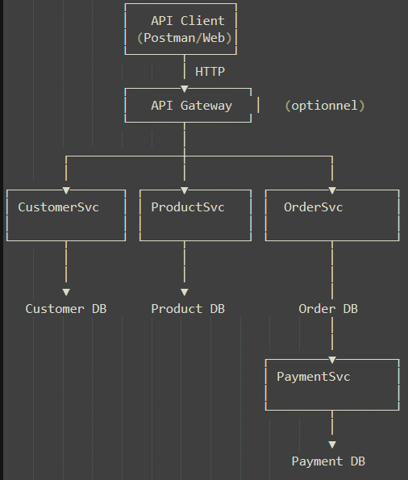

# go-micros-hexa-shop : Microservices + Archi Hexagonale

# 1. Présentation générale

Le projet **go-micros-hexa-shop** est un écosystème de microservices écrit en langage **Go**, structuré selon les principes de l'**architecture hexagonale: Ports & Adapters**.  
Il illustre une plateforme de type e-commerce modulaire, avec séparation claire des responsabilités métier, techniques et d'orchestration.

L'architecture repose sur :
- des microservices indépendants: **customer** / **Product** / **Order**
- une base de données par microservice
- une **API Gateway Kong** comme point d'entrée unique
- des échanges synchrones REST entre microservices

---

# 2. Fonction principale de go-micros-hexa-shop

La fonction principale de l'application **go-micros-hexa-shop** est de **gérer le cycle de vie d'une commande client**, depuis la validation du customer, des produits et du stock jusqu'à la persistance de la commande, dans un environnement distribué.

L'application **go-micros-hexa-shop** :
- la gestion des clients: customer-microservice
- la gestion des produits, stocks et localisations: product-microservice
- la création de commandes avec vérification du state du produit et la quantité du produit en stock: order-microservice
- la mise à jour des quantités disponibles après qu'une commande est validée: couple (order-microservice, product-microservice)

---

# 3. Architecture globale

## 3.1 Microservices

| Microservice | Port | Responsabilité principale 
|--------------|------|---------------------------
| customer-microservice | 8081 | Gestion des clients 
| product-microservice  | 8082 | Produits, stocks, locations
| order-microservice    | 8083 | Commandes & orchestration
| Kong API Gateway      | 8080 | Point d’entrée unique

Chaque microservice :
- est autonome
- possède sa propre base de données
- expose une API REST
- implémente une **architecture hexagonale**

---

## 3.2 Architecture hexagonale: Ports & Adapters

A l'exemple de la structure suivante de order-microservice, chaque microservice est structuré de la même manière :
```
order-microservice/
├── cmd/
│   └── api/
│       ├── main.go                                     # composition root (wiring)
│
├── internal/
│   ├── domain/                                         # 1️⃣ OBJETS MÉTIER (purs)
│   │   ├── order.go                                    # Order objet métier
│   │   ├── customer.go                                 # Customer objet métier pour representer le remote customer dans customer-microservice
│   │   ├── product.go                                  # Product objet métier pour representer le remote product dans product-microservice
│   ├── application/                                    # 2️⃣ USE CASES + PORTS
│   │   ├── ports/
│   │   │   ├── in/
│   │   │   │   ├── order_in_port.go                     # InOrderService port d'entrée exposé à l'extérieur
│   │   │   │   ├── customer_in_port.go                  # InCustomerService port d'entrée exposé à l'extérieur
|   |   |   |   ├── product_in_port.go                   # InProcutService port d'entrée exposé à l'exterieur
|   |   |   |   ├── stock_in_port.go                     # InStockService port d'entrée exposé à l'exterieur
|   |   |   |   ├── location_in_port.go                  # InLocationService port d'entrée exposé à l'exterieur
│   │   │   ├── out/
│   │   │   │   ├── order_out_port.go                    # OutOrderService port utilisé par le domaine de l'application pour communiquer à l'extérieur
│   │   │   │   ├── customer_out_port.go                 # OutCustomerService port utilisé par le domaine de l'application pour communiquer à l'extérieur
|   |   |   |   ├── product_out_port.go                  # OutProcutService port utilisé  par le domaine de l'application pour communiquer à l'extérieur
|   |   |   |   ├── stock_in_port.go                     # OutStockService port utilisé par le domaine de l'application pour communiquer à l'extérieur
|   |   |   |   └── location_in_port.go                  # OutLocationService port utilisé par le domaine de l'application pour communiquer à l'extérieur
|   |   |   |
│   │   │   └── usecase/                                 # ✅ usecase implemente les input ports
│   │   │       ├── order_usecase.go                        
│   │   │       ├── customer_usecase.go                  # récupérer le customer depuis les remote customer-microservice
│   │   │       ├── product_usecase.go                   # récupérer le product depuis les remote product-microservice
│   │   │       ├── stock_usecase.go                     # récupérer le stock du produit depuis les remote product-microservice
│   │   │       ├── location_usecase.go                  # récupérer la localisation (ville) du stock du produit depuis les remote product-microservice
│   │   │       ├── fieds_checker.go                     # validation des champs du métier
│   │   |       └── errors.go                            # erreurs métier
│   │   │
│   ├── infrastructure/                                  # 3️⃣ ADAPTERS (extérieur)         
│   │   ├── in/
│   │   │   └── web/
│   │   │       ├── handlers/
|   |   |       |   ├── order_handler_impl.go            # impl OrderHandlerService  
|   |   |       ├── routes/                              # register routes 
|   |   |       |   ├── contract.go                      # interface OrderHandlerService: gin-gonic
|   |   |       |   └── route_register.go                # engeristrement des routes: gin
|   |   |       |                   
│   │   │       ├── dtos/                                # ✅  les user dtos                             
│   │   │       │   ├── order_request.go
│   │   │       │   ├── order_response.go
│   │   │       │   ├── customer_response.go             # customerResponse chargé depuis la base (le remote customer-microservice)
│   │   │       │   ├── product_response.go              # productResponse chargé depuis la base (le remote product-microservice)
│   │   │       │   ├── stock_response.go                # stockResponse chargé depuis la base (le remote product-microservice)
│   │   │       │   └── location_response.go             # locationResponse chargé depuis la base (le remote product-microservice)
|   |   |       |
│   │   │       └── mappers/                             # ✅ mappers de transformation
│   │   │           ├── order_mapper.go
│   │   │           ├── customer_mapper.go
│   │   │           ├── product_mapper.go
│   │   │           ├── stock_mapper.go
│   │   │           └── location_mapper.go
│   │   │
│   │   ├── out/                                                # ✅ save dans la db
│   │   |       └── services/                       
│   │   |           ├── db.go                                   # db *sql.DB par exemple
│   │   |           ├── models/                                 # les entités à enregistrer en db
│   │   |           │   ├── order_model.go                      # model de données pour la table orders
│   │   |           │   └── order_lines_model.go                # model de données pour la table orderline
│   │   |           ├── mappers/
│   │   |           │   └── order_mapper.go
|   |   |           ├── repositories                            # ✅ la couche de données (db)
|   |   |           |   ├── order_repo_impl.go                  # implementation de order repository
│   │   |           │   └── order_lines_repo_impl.go            #  implementation de orderline repository
│   │   |           └── services/                               # ✅ implementation des outputs ports
|   |   |               ├── generic_repos.go                    # repo generic de centralisation des méthodes communes à toutes les entités (Save, findByID,FindAll) 
|   |   |               ├── repos.go                            # repo extends repo generic,certaines autres méthodes sont spécifiques à une entités sont dans repos
│   │   |               ├── order_out_port_impl.go              # OutOrderServiceImpl impl du order output port
│   │   |               ├── order_line_out_port_impl.go         # OutOrderLineServiceImpl impl du orderline output port
│   │   |               ├── remote_customer_out_port_impl.go    # OutRemoteCustomerServiceImpl impl du remote customer output port
│   │   |               ├── remote_product_out_port_impl.go     # OutRemoteProductServiceImpl impl du remote procut output port
│   │   |               ├── remote_stock_out_port_impl.go       # OutRemoteStockServiceImpl impl du remote stock output port
│   │   |               ├── remote_location_out_port_impl.go    # OutRemoteLocationServiceImpl impl du remote location output port
│   │   |
│   |   ├── config/                                             # 4️⃣ la config des env vars
│   │       └── config.go
│   │
├── migrations/                                             
│   └── 001_create_tables.sql                                   # Tables: orders et orderlines                         
│
├── .gitignore
├── go.mod
├── go.sum
└── README.md
```
Les autres microservices: product-microservice, order-microservice possèdent le même organigramme.

## Architecture globale Microservices



LÉGENDE
-------
- Chaque microservice est autonome et possède sa propre base de données
- Les communications inter-microservices se font via HTTP REST
- OrderSvc orchestre les appels vers les microservices CustomerSvc et ProductSvc
      - pour vérifier le status (active) du customer sinon refuser la commande
      - pour vérifier le status (true) du produit sinon réfuser la commande
      - pour vérifier la quantité de ce produit en stock
- Kong Api Gateway agit comme point d’entrée unique (API Gateway)
- Architecture Hexagonale basée sur les principes Ports & Adapters

Le domaine ne dépend jamais :
- ni du HTTP
- ni de la base de données
- ni des autres microservices

---

# 4. API Gateway – Kong

## 4.1 Rôle de Kong

**Kong** agit comme **API Gateway** et constitue le **point d'entrée unique** du système.

Il est responsable de :
- router les requêtes HTTP vers les microservices : Customer / Product / Order
- centraliser l'accès aux APIs
- préparer l'ajout de préoccupations transverses :
    - caching,
    - rate limiting,
    - logs,
    - CORS

La configuration est déclarative via le fichier `./kong.yml`

---

## 4.2 Flow d'une request client via Kong

Client  
    ↓  
Kong API Gateway  
    ↓  
Microservice cible (Customer / Product / Order  

Exemple :  

[POST] http://localhost:8080/api/v1/orders   
→ Kong  
→ order-microservice  
→ customer-microservice  
→ product-microservice (stock, location, produit)  
→ base de donnée  

---

# 5. Documentation par microservice

---

## 5.1 Customer Microservice (8081)

### Fonction principale
Gérer les **clients** et leurs informations associées.

### Périmètre fonctionnel
- Création d’un client
- Consultation d’un client
- Mise à jour des informations
- Suppression ou désactivation logique

### Responsabilités
- Validation des données client
- Persistance en base
- Exposition d’une API REST

### Exemples d'API
- [GET] http://localhost:8080/api/v1/customers
- [GET] http://localhost:8080/api/v1/customers/{id}
- [POST] http://localhost:8080/api/v1/customers
- [PUT] http://localhost:8080//api/v1/customers/{id}
- [DELETE] http://localhost:8080/api/v1/customers/{id}

---

## 5.2 Product Microservice (8082)

### Fonction principale
Gérer le **catalogue produit**, les **stocks** et les **localisations**.

### Périmètre fonctionnel

#### Produits
- Création / mise à jour
- Activation / désactivation
- Consultation

#### Locations
- Gestion des lieux (villes / entrepôts)

#### Stocks
- Stock par couple `(product, location)`
- Quantité toujours ≥ 0
- Consultation et mise à jour

### APIs principales
- [POST] http://localhost:8080/api/v1/locations
- [POST] http://localhost:8080/api/v1/products
- [POST] http://localhost:8080/api/v1/stocks
- [GET] http://localhost:8080/api/v1/products/{id}
- [GET] http://localhost:8080/api/v1/locations/{id}
- [GET] http://localhost:8080/api/v1/stocks
- [GET] http://localhost:8080/api/v1/stocks/locations/{locationId}/products/{productId}
- [PUT] http://localhost:8080/api/v1/stocks/locations/{locationId}/products/{productId}/set-qte  
Body json attendu pour la mise à jour (PUT) :
```
{
  "quantity": 150
}
```

## 5.3 Order Microservice (8082)

### Fonction principale
Gérer les **commandes** et orchestrer les appels vers les autres microservices.

### Périmètre fonctionnel

- Création d’une commande
- Gestion des lignes de commande
- Vérification produit & stock
- Mise à jour du stock distant
- Persistance de la commande

### Flux de création d’une commande
1. Réception de la requête client
2. Vérification du client et sont state (remote Customer microservice)
2. Vérification des produits et leur state (remote Product microservice)
3. Vérification du stock par ligne (remote Product microservice)
4. Refus si stock insuffisant (remote Product microservice)
5. Mise à jour du stock (remote Product microservice)
6. Enregistrement de la commande

#### Exemple de requête
```
{
  "customer_id": 1,
  "order_lines": [
    { "product_id": 2, "location_id": 1, "quantity": 5 },
    { "product_id": 1, "location_id": 1, "quantity": 3 }
  ]
}
```

# 6. Documentation développeur

## Pré-requis
- Go (modules)
- Docker & Docker Compose
- PostgreSQL

## Démarrage
- Récupérer le repo git `git clone -b main https://github.com/trng-tr/go-micros-hex.git`
- Aller à la racine (contexte) de l'application et builder les sources pour construire les images dockers: `docker compose -f stack-docker.yaml build`
- Lancer la stack via stack-docker.yml: `docker compose -f stack-docker.yaml up -d`
- Vérifier la disponibilité de Kong et des microservices
- Utiliser Kong comme point d’entrée principal

## Variables d’environnement (exemple)
- APP_HOSTNAME 
- PORT
- DB_HOST
- DB_PORT
- DB_NAME
- DB_USER
- DB_PASSWORD
- PRODUCT_SERVICE_URL (Order Microservice)
- CUSTOMER_SERVICE_URL (Order Microservice)

# 7. Gestion des erreurs

Les erreurs sont renvoyées sous forme :
```
{
  "status": "FAIL",
  "message": "description",
  "created_at": "ISO_DATE"
}

```


